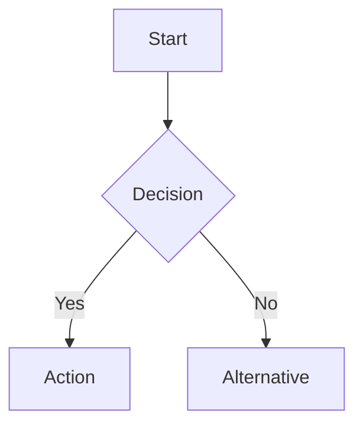
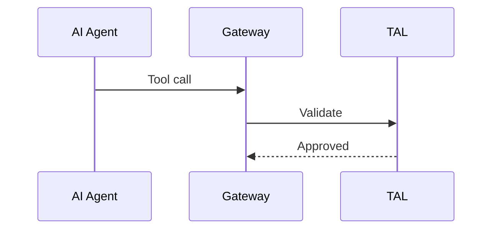
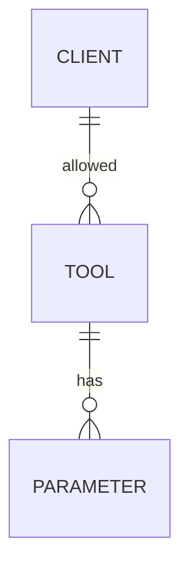

# CONTRIBUTING.md

# Contributing to AI Tool Boundaries Framework

Thank you for considering contributions to this security framework. Your experience and expertise help improve MCP security for the entire community.

## How to Contribute

### Types of Contributions

**Real-World Deployment Experiences**

- Production deployment case studies
- Lessons learned from security incidents
- Performance and scalability observations
- Tool schema examples from production use

**Threat Intelligence**

- New attack vectors or techniques
- Prompt injection patterns discovered in the wild
- Vulnerability disclosures (responsibly)
- Breach analysis relevant to MCP deployments

**Technical Improvements**

- Additional architecture patterns
- Enhanced validation techniques
- Monitoring and detection strategies
- Implementation code examples

**Compliance Guidance**

- Industry-specific requirements (HIPAA, FedRAMP, etc.)
- Additional framework mappings (PCI DSS, NIST CSF, etc.)
- Audit evidence examples
- Assessment procedures

**Documentation**

- Clarifications and corrections
- Additional use case examples
- Translations to other languages
- Diagram improvements

## Contribution Process

### 1. Check Existing Issues

Before starting work:

- Review open issues for duplicates
- Check if someone is already working on similar changes
- Comment on the issue to coordinate

### 2. Fork and Branch

```bash
# Fork the repository on GitHub
# Clone your fork
git clone [https://github.com/YOUR-USERNAME/ai-tool-boundaries.git](https://github.com/YOUR-USERNAME/ai-tool-boundaries.git)
cd ai-tool-boundaries

# Create a feature branch
git checkout -b feature/your-contribution-name
```

### 3. Make Changes

**Documentation Style:**

- Use active voice
- Write concisely with high information density
- Provide concrete examples over abstract concepts
- Include Mermaid diagrams for complex architectures
- Cite sources for threat intelligence and breach examples

**Technical Content:**

- Validate JSON Schema examples
- Test code snippets before submission
- Include realistic parameter values
- Document assumptions and prerequisites

**Formatting:**

- Use Markdown with consistent heading levels
- Code blocks must specify language (`json,` yaml, etc.)
- Tables for structured comparisons
- Lists for action items or enumerations

### 4. Test Your Changes

- Verify all links work
- Ensure Mermaid diagrams render correctly
- Check code examples for syntax errors
- Validate JSON/YAML against schemas
- Review for typos and grammatical errors

### 5. Commit and Push

```bash
# Stage changes
git add .

# Commit with descriptive message
git commit -m "Add: Tool schema example for customer data access"

# Push to your fork
git push origin feature/your-contribution-name
```

**Commit Message Format:**

```
[Type]: Brief description (50 chars max)

Detailed explanation of changes, why they were needed,
and any relevant context. Reference issues with #123.

Types: Add, Update, Fix, Remove, Refactor, Document
```

### 6. Submit Pull Request

- Use a clear, descriptive title
- Reference related issues
- Explain the motivation for changes
- Describe testing performed
- Note any breaking changes

**PR Template:**

```markdown
## Summary
[Brief description of changes]

## Motivation
[Why these changes are needed]

## Changes Made
- [Change 1]
- [Change 2]

## Testing
[How changes were validated]

## Related Issues
Closes #123
Related to #456

## Checklist
- [ ] Documentation updated
- [ ] Examples tested
- [ ] Diagrams render correctly
- [ ] No broken links
- [ ] Follows style guide
```

## Content Guidelines

### Security Disclosures

**Do not** publicly disclose vulnerabilities in:

- Specific vendor implementations
- Production MCP deployments
- Zero-day vulnerabilities

**Instead:**

1. Report privately to affected vendors
2. Allow 90 days for remediation
3. Coordinate disclosure timeline
4. Anonymize examples when adding to framework

### Real-World Examples

When sharing deployment experiences:

**Do:**

- Anonymize organization names and specifics
- Share lessons learned and outcomes
- Provide metrics when possible (attack detection rates, false positives, etc.)
- Explain context and constraints

**Don't:**

- Include proprietary information
- Share customer data or internal system details
- Name individuals without permission
- Criticize specific vendors or products

### Code Examples

All code examples should:

- Be self-contained and runnable (where applicable)
- Include comments explaining security considerations
- Use placeholder values for secrets/credentials
- Follow language-specific best practices
- Include error handling

**Example:**

```python
# Good: Complete example with error handling
import json
from jsonschema import validate, ValidationError

def validate_tool_call(tool_name: str, parameters: dict) -> bool:
    """Validate tool call against schema before execution.
    
    Args:
        tool_name: Name of tool being invoked
        parameters: Tool parameters to validate
        
    Returns:
        True if validation passes
        
    Raises:
        ValidationError: If parameters don't match schema
    """
    schema = load_tool_schema(tool_name)  # Load from schema registry
    
    try:
        validate(instance=parameters, schema=schema)
        return True
    except ValidationError as e:
        # Log validation failure for security monitoring
        log_validation_failure(tool_name, parameters, str(e))
        raise
```

### Diagrams

Use Mermaid for architecture diagrams:

**Flowcharts** for processes:



**Sequence diagrams** for request flows:



**Entity relationships** for data models:



## Review Process

### What We Look For

**Technical Accuracy:**

- Security recommendations are sound
- Examples are realistic and tested
- Threat models are evidence-based
- Compliance mappings are correct

**Clarity:**

- Content is understandable to target audience
- Examples illuminate concepts
- Structure supports comprehension
- Terminology is consistent

**Completeness:**

- Changes include necessary context
- Examples cover edge cases
- Documentation is updated
- Related sections are consistent

### Timeline

- Initial review: Within 7 days
- Feedback incorporated: Contributor timeline
- Final review: Within 3 days of updates
- Merge: After approval from maintainer

### Feedback Format

Reviewers will provide:

- Specific line-by-line comments
- Suggested alternatives where applicable
- Explanation of concerns
- Recognition of good contributions

## Recognition

Contributors are recognized in:

- Acknowledgments section of main paper
- [CONTRIBUTORS.md](http://CONTRIBUTORS.md) file
- Release notes for significant contributions

## Questions?

Not sure if your contribution fits? Open an issue to discuss:

- Proposed changes before investing time
- Alternative approaches
- Scope and fit for the framework

## Code of Conduct

This project follows standard open source community norms:

**Expected:**

- Professional and respectful communication
- Constructive feedback and collaboration
- Focus on improving security for all
- Recognition of diverse perspectives

**Not Tolerated:**

- Harassment or discriminatory behavior
- Disclosure of vulnerabilities without coordination
- Spam or promotional content
- Bad faith arguments or trolling

## License

By contributing, you agree that your contributions will be licensed under the same MIT License that covers the project.

---

**Thank you for helping improve MCP security!**