# Visual Summary: Defense Layers

This page provides a comprehensive visual reference for the defense-in-depth architecture of the MCP security framework.

💡 **How to use this page:** This is your visual reference sheet. Bookmark it and return whenever you need to explain MCP security visually. Each diagram is production-ready for presentations.

---

## 🎯 One-Page Visual Summary

### The 3-Second Pitch

**5 layers** of defense → **5 threat types** mitigated → **3 compliance frameworks** satisfied

### The 30-Second Pitch

MCP introduces critical security risks (prompt injection, data exfiltration, credential theft). This framework provides **defense-in-depth** across network, authentication, authorization, validation, and audit layers. Result: **Production-ready AI integration** with **compliance-ready evidence**.

---

## Complete Defense Architecture

## Control Effectiveness Matrix

## Data Flow with Security Controls

## Risk-Control Mapping

| Risk Level | Threat Category | Primary Controls | Residual Risk |
| --- | --- | --- | --- |
| 🔴 Critical | Prompt Injection | Schema Validation + Type Enforcement + Semantic Analysis | 🟡 Low |
| 🔴 Critical | Data Exfiltration | Parameter Constraints + Output Redaction + Rate Limits | 🟡 Low |
| 🟠 High | Credential Theft | mTLS + Short-lived Certs + Secret Rotation | 🟢 Very Low |
| 🟠 High | Tool Chaining | Tool Allowlisting + Audit Correlation + Anomaly Detection | 🟡 Low |
| 🟠 High | Overprivileged Access | Least Privilege + Regular Reviews + Usage Monitoring | 🟢 Very Low |
| 🟡 Medium | Schema Bypass | Input Validation + Additional Properties: False | 🟢 Very Low |
| 🟡 Medium | Rate Limit Evasion | Multi-dimensional Limits + Circuit Breakers | 🟢 Very Low |

## Security Posture Progression

```mermaid
graph LR
    A[Baseline:<br/>No MCP Security] --> B[Phase 1:<br/>Basic Controls]
    B --> C[Phase 2:<br/>Enhanced Controls]
    C --> D[Phase 3:<br/>Operational Maturity]
    D --> E[Phase 4:<br/>Production Ready]
    E --> F[Phase 5:<br/>Continuous Improvement]
    
    subgraph "Risk Level"
        R1[🔴 Critical]
        R2[🟠 High]
        R3[🟡 Medium]
        R4[🟢 Low]
        R5[🟢 Very Low]
    end
    
    A -.-> R1
    B -.-> R2
    C -.-> R3
    D -.-> R4
    E -.-> R5
    F -.-> R5
    
    style A fill:#ff6b6b
    style B fill:#ffd93d
    style C fill:#fff3cd
    style D fill:#d1ecf1
    style E fill:#d4edda
    style F fill:#95e1d3
```

## Compliance Control Coverage

