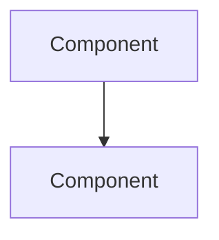

# architecture-diagrams.md

# Architecture Diagrams

Comprehensive visual architecture references for the MCP security framework.

## Available Diagrams

All diagrams are provided in Mermaid format for GitHub rendering and as exportable SVG/PNG.

**Location:** All diagram source files are available at [diagrams/](diagrams%20691ff96c43334c969559e5b8e86df51d.md)

### 1. MCP Gateway Three-Zone Architecture

**File:** [mcp-gateway-architecture.mermaid](diagrams/mcp-gateway-architecture%20mermaid%20e5461680d60f4f5a9af99f471a4102c7.md)

**Description:** Complete isolation pattern showing Untrusted, Security Boundary, and Trusted zones

**Use Case:** Executive presentations, architecture reviews, security documentation

### 2. Tool Access Layer Request Flow

**File:** [tal-request-flow.mermaid](diagrams/tal-request-flow%20mermaid%20e88e53ee73e64256a4394a2b83d8782a.md)

**Description:** Sequence diagram showing authentication → validation → authorization → execution

**Use Case:** Developer onboarding, security training, audit documentation

### 3. Network Segmentation Design

**File:** [network-segmentation.mermaid](diagrams/network-segmentation%20mermaid%2025a177e72cce441a8932492122b81be2.md)

**Description:** DMZ deployment with firewall rules and mTLS connections

**Use Case:** Network architecture planning, infrastructure deployment

### 4. Authorization Decision Tree

**File:** [authorization-flow.mermaid](diagrams/authorization-flow%20mermaid%2054ea44778e4348a5a06897a7a50242e4.md)

**Description:** Flowchart showing all authorization checkpoints and failure modes

**Use Case:** Security policy documentation, incident analysis

### 5. Threat Landscape Map

**File:** [threat-landscape.mermaid](diagrams/threat-landscape%20mermaid%2054e151e988234a0fab301593453eae13.md)

**Description:** Attack vectors, threat actors, and outcomes visualization

**Use Case:** Threat modeling sessions, risk assessments, stakeholder briefings

### 6. Compliance Control Coverage

**File:** [compliance-coverage.mermaid](diagrams/compliance-coverage%20mermaid%205e34f83277d242de952bc2750b93a5c6.md)

**Description:** Mapping of framework controls to SOC 2, ISO 27001, GDPR

**Use Case:** Compliance audits, regulatory documentation, certification preparation

### 7. Defense-in-Depth Layers

**File:** [defense-layers.mermaid](diagrams/defense-layers%20mermaid%201b132d36f056467daad5e9ed79bf34e5.md)

**Description:** Five-layer security architecture with control effectiveness

**Use Case:** Security architecture reviews, training materials

### 8. Monitoring Architecture

**File:** [monitoring-architecture.mermaid](diagrams/monitoring-architecture%20mermaid%20da4f5b57b2554d3a981b0f3558e511ff.md)

**Description:** Log aggregation, SIEM integration, alerting pipelines

**Use Case:** Operations setup, SOC integration, incident response planning

## Export Instructions

### For GitHub

Mermaid diagrams render natively in GitHub markdown. Simply include:

```markdown

```

### For Presentations

Use [Mermaid Live Editor](https://mermaid.live) to export as:

- SVG (vector graphics, scales perfectly)
- PNG (raster images, specific resolution)
- PDF (print-ready documents)

### For Documentation Sites

Most documentation generators (MkDocs, Docusaurus, Hugo) support Mermaid natively or via plugins.

## Customization

All diagrams use semantic color coding:

- 🔴 Red (`#ff6b6b`): Threats, untrusted zones, critical risks
- 🟠 Orange (`#ffd93d`): Medium risks, DMZ zones, warnings
- 🟡 Yellow (`#ffe66d`): Logging, monitoring, informational
- 🟢 Green (`#95e1d3`): Trusted zones, approved actions, low risk
- 🔵 Blue (`#4ecdc4`): Security controls, authentication, enforcement

Modify colors in Mermaid `style` declarations to match your organization's branding.