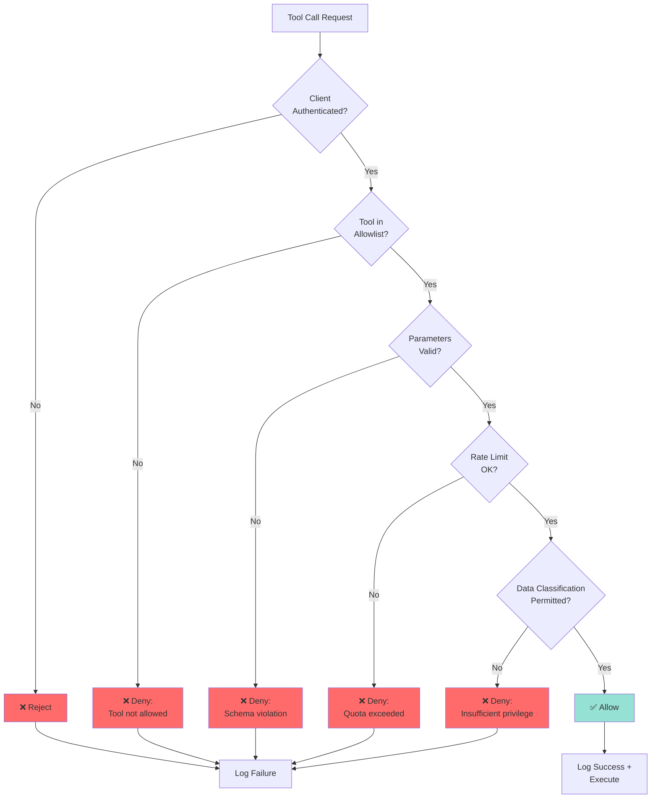

# authorization-flow.mermaid

```mermaid
flowchart TD
    A[Tool Call Request] --> B{Client<br/>Authenticated?}
    B -->|No| C[❌ Reject]
    B -->|Yes| D{Tool in<br/>Allowlist?}
    D -->|No| E[❌ Deny:<br/>Tool not allowed]
    D -->|Yes| F{Parameters<br/>Valid?}
    F -->|No| G[❌ Deny:<br/>Schema violation]
    F -->|Yes| H{Rate Limit<br/>OK?}
    H -->|No| I[❌ Deny:<br/>Quota exceeded]
    H -->|Yes| J{Data Classification<br/>Permitted?}
    J -->|No| K[❌ Deny:<br/>Insufficient privilege]
    J -->|Yes| L[✅ Allow]
    
    C --> M[Log Failure]
    E --> M
    G --> M
    I --> M
    K --> M
    L --> N[Log Success +<br/>Execute]
    
    style C fill:#ff6b6b
    style E fill:#ff6b6b
    style G fill:#ff6b6b
    style I fill:#ff6b6b
    style K fill:#ff6b6b
    style L fill:#95e1d3
```