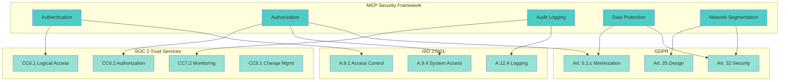

# compliance-coverage.mermaid

```mermaid
graph TB
    subgraph "MCP Security Framework"
        A[Authentication]
        B[Authorization]
        C[Audit Logging]
        D[Data Protection]
        E[Network Segmentation]
    end
    
    subgraph "SOC 2 Trust Services"
        F[CC6.1 Logical Access]
        G[CC6.2 Authorization]
        H[CC7.2 Monitoring]
        I[CC8.1 Change Mgmt]
    end
    
    subgraph "ISO 27001"
        J[A.9.1 Access Control]
        K[A.9.4 System Access]
        L[A.12.4 Logging]
    end
    
    subgraph "GDPR"
        M[Art. 5.1.c Minimization]
        N[Art. 25 Design]
        O[Art. 32 Security]
    end
    
    A --> F
    A --> J
    B --> G
    B --> K
    B --> M
    C --> H
    C --> L
    D --> M
    D --> O
    E --> N
    E --> O
    
    style A fill:#4ecdc4
    style B fill:#4ecdc4
    style C fill:#4ecdc4
    style D fill:#4ecdc4
    style E fill:#4ecdc4
    style F fill:#95e1d3
    style G fill:#95e1d3
    style H fill:#95e1d3
    style I fill:#95e1d3
    style J fill:#95e1d3
    style K fill:#95e1d3
    style L fill:#95e1d3
    style M fill:#95e1d3
    style N fill:#95e1d3
    style O fill:#95e1d3
```