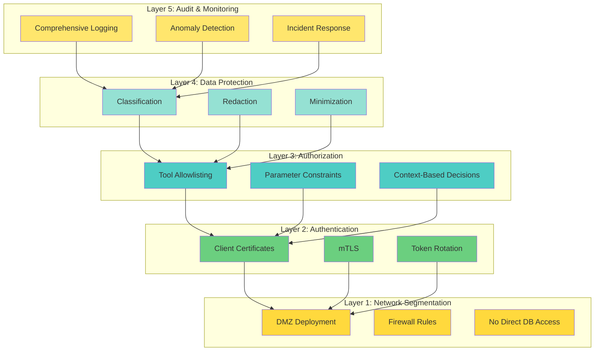

# defense-layers.mermaid

```mermaid
graph TB
    subgraph "Layer 5: Audit & Monitoring"
        A[Comprehensive Logging]
        B[Anomaly Detection]
        C[Incident Response]
    end
    
    subgraph "Layer 4: Data Protection"
        D[Classification]
        E[Redaction]
        F[Minimization]
    end
    
    subgraph "Layer 3: Authorization"
        G[Tool Allowlisting]
        H[Parameter Constraints]
        I[Context-Based Decisions]
    end
    
    subgraph "Layer 2: Authentication"
        J[Client Certificates]
        K[mTLS]
        L[Token Rotation]
    end
    
    subgraph "Layer 1: Network Segmentation"
        M[DMZ Deployment]
        N[Firewall Rules]
        O[No Direct DB Access]
    end
    
    A --> D
    B --> D
    C --> D
    D --> G
    E --> G
    F --> G
    G --> J
    H --> J
    I --> J
    J --> M
    K --> M
    L --> M
    
    style A fill:#ffe66d
    style B fill:#ffe66d
    style C fill:#ffe66d
    style D fill:#95e1d3
    style E fill:#95e1d3
    style F fill:#95e1d3
    style G fill:#4ecdc4
    style H fill:#4ecdc4
    style I fill:#4ecdc4
    style J fill:#6bcf7f
    style K fill:#6bcf7f
    style L fill:#6bcf7f
    style M fill:#ffd93d
    style N fill:#ffd93d
    style O fill:#ffd93d
```