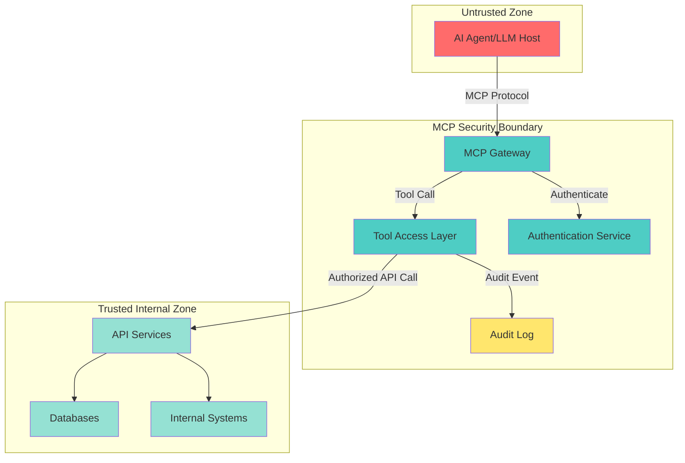

# mcp-gateway-architecture.mermaid

```mermaid
graph TB
    subgraph "Untrusted Zone"
        A[AI Agent/LLM Host]
    end
    
    subgraph "MCP Security Boundary"
        B[MCP Gateway]
        C[Tool Access Layer]
        D[Authentication Service]
        E[Audit Log]
    end
    
    subgraph "Trusted Internal Zone"
        F[API Services]
        G[Databases]
        H[Internal Systems]
    end
    
    A -->|MCP Protocol| B
    B -->|Authenticate| D
    B -->|Tool Call| C
    C -->|Audit Event| E
    C -->|Authorized API Call| F
    F --> G
    F --> H
    
    style A fill:#ff6b6b
    style B fill:#4ecdc4
    style C fill:#4ecdc4
    style D fill:#4ecdc4
    style E fill:#ffe66d
    style F fill:#95e1d3
    style G fill:#95e1d3
    style H fill:#95e1d3
```