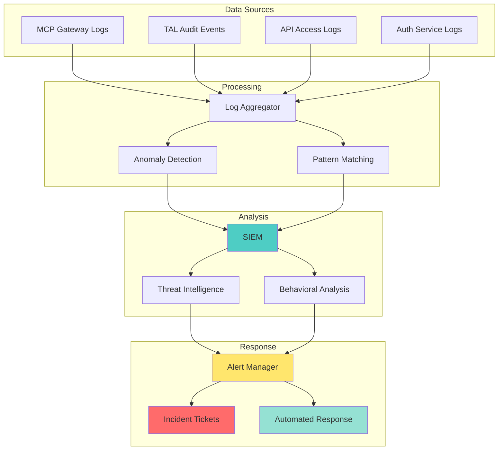

# monitoring-architecture.mermaid

```mermaid
graph TB
    subgraph "Data Sources"
        A[MCP Gateway Logs]
        B[TAL Audit Events]
        C[API Access Logs]
        D[Auth Service Logs]
    end
    
    subgraph "Processing"
        E[Log Aggregator]
        F[Anomaly Detection]
        G[Pattern Matching]
    end
    
    subgraph "Analysis"
        H[SIEM]
        I[Threat Intelligence]
        J[Behavioral Analysis]
    end
    
    subgraph "Response"
        K[Alert Manager]
        L[Incident Tickets]
        M[Automated Response]
    end
    
    A --> E
    B --> E
    C --> E
    D --> E
    
    E --> F
    E --> G
    
    F --> H
    G --> H
    H --> I
    H --> J
    
    I --> K
    J --> K
    
    K --> L
    K --> M
    
    style H fill:#4ecdc4
    style K fill:#ffe66d
    style L fill:#ff6b6b
    style M fill:#95e1d3
```