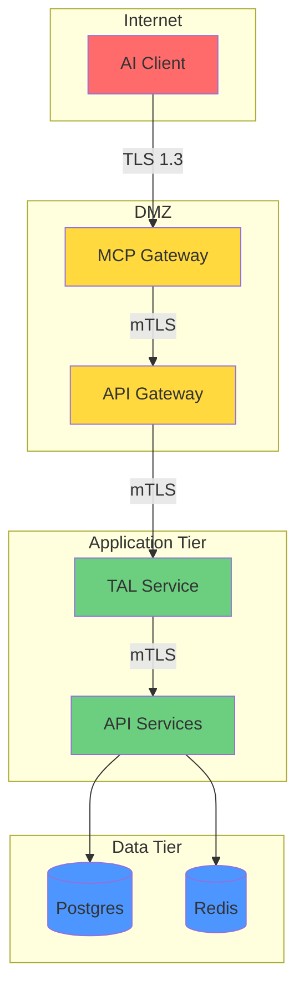

# network-segmentation.mermaid

```mermaid
graph TB
    subgraph "Internet"
        A[AI Client]
    end
    
    subgraph "DMZ"
        B[MCP Gateway]
        C[API Gateway]
    end
    
    subgraph "Application Tier"
        D[TAL Service]
        E[API Services]
    end
    
    subgraph "Data Tier"
        F[(Postgres)]
        G[(Redis)]
    end
    
    A -->|TLS 1.3| B
    B -->|mTLS| C
    C -->|mTLS| D
    D -->|mTLS| E
    E --> F
    E --> G
    
    style A fill:#ff6b6b
    style B fill:#ffd93d
    style C fill:#ffd93d
    style D fill:#6bcf7f
    style E fill:#6bcf7f
    style F fill:#4d96ff
    style G fill:#4d96ff
```