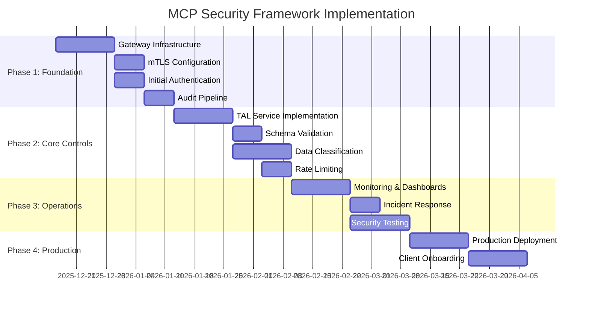

# phased-deployment.mermaid

```mermaid
gantt
    title MCP Security Framework Implementation
    dateFormat YYYY-MM-DD
    section Phase 1: Foundation
    Gateway Infrastructure       :p1a, 2025-12-16, 2w
    mTLS Configuration           :p1b, after p1a, 1w
    Initial Authentication       :p1c, after p1a, 1w
    Audit Pipeline              :p1d, after p1b, 1w
    
    section Phase 2: Core Controls
    TAL Service Implementation   :p2a, after p1d, 2w
    Schema Validation           :p2b, after p2a, 1w
    Data Classification         :p2c, after p2a, 2w
    Rate Limiting               :p2d, after p2b, 1w
    
    section Phase 3: Operations
    Monitoring & Dashboards     :p3a, after p2d, 2w
    Incident Response           :p3b, after p3a, 1w
    Security Testing            :p3c, after p3a, 2w
    
    section Phase 4: Production
    Production Deployment       :p4a, after p3c, 2w
    Client Onboarding          :p4b, after p4a, 2w
```