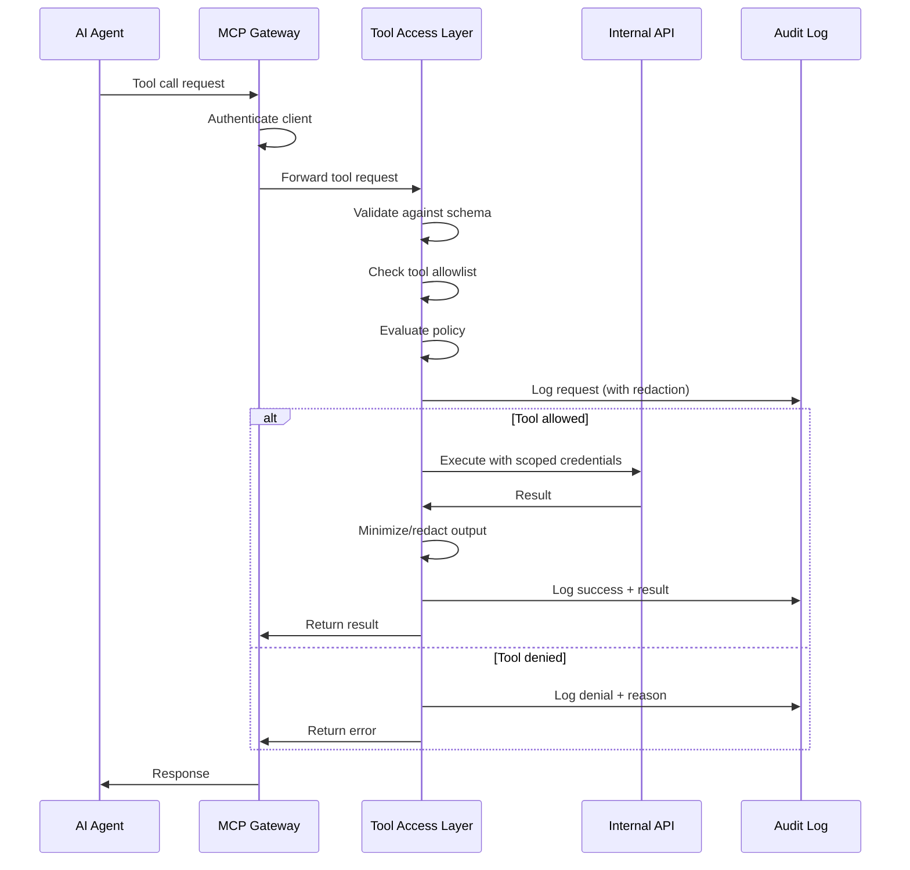

# tal-request-flow.mermaid

```mermaid
sequenceDiagram
    participant Agent as AI Agent
    participant MCP as MCP Gateway
    participant TAL as Tool Access Layer
    participant API as Internal API
    participant Audit as Audit Log
    
    Agent->>MCP: Tool call request
    MCP->>MCP: Authenticate client
    MCP->>TAL: Forward tool request
    TAL->>TAL: Validate against schema
    TAL->>TAL: Check tool allowlist
    TAL->>TAL: Evaluate policy
    TAL->>Audit: Log request (with redaction)
    alt Tool allowed
        TAL->>API: Execute with scoped credentials
        API->>TAL: Result
        TAL->>TAL: Minimize/redact output
        TAL->>Audit: Log success + result
        TAL->>MCP: Return result
    else Tool denied
        TAL->>Audit: Log denial + reason
        TAL->>MCP: Return error
    end
    MCP->>Agent: Response
```