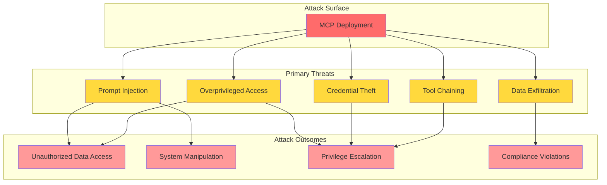

# threat-landscape.mermaid

```mermaid
graph TB
    subgraph "Attack Surface"
        A[MCP Deployment]
    end
    
    subgraph "Primary Threats"
        B[Prompt Injection]
        C[Overprivileged Access]
        D[Credential Theft]
        E[Data Exfiltration]
        F[Tool Chaining]
    end
    
    subgraph "Attack Outcomes"
        G[Unauthorized Data Access]
        H[System Manipulation]
        I[Privilege Escalation]
        J[Compliance Violations]
    end
    
    A --> B
    A --> C
    A --> D
    A --> E
    A --> F
    
    B --> G
    B --> H
    C --> G
    C --> I
    D --> I
    E --> J
    F --> I
    
    style A fill:#ff6b6b
    style B fill:#ffd93d
    style C fill:#ffd93d
    style D fill:#ffd93d
    style E fill:#ffd93d
    style F fill:#ffd93d
    style G fill:#ff9999
    style H fill:#ff9999
    style I fill:#ff9999
    style J fill:#ff9999
```